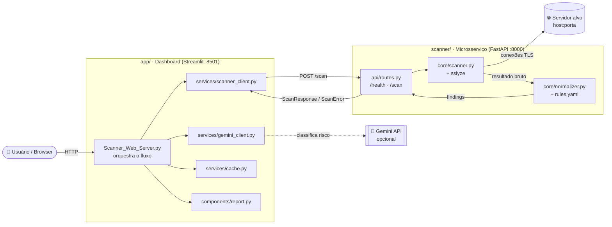
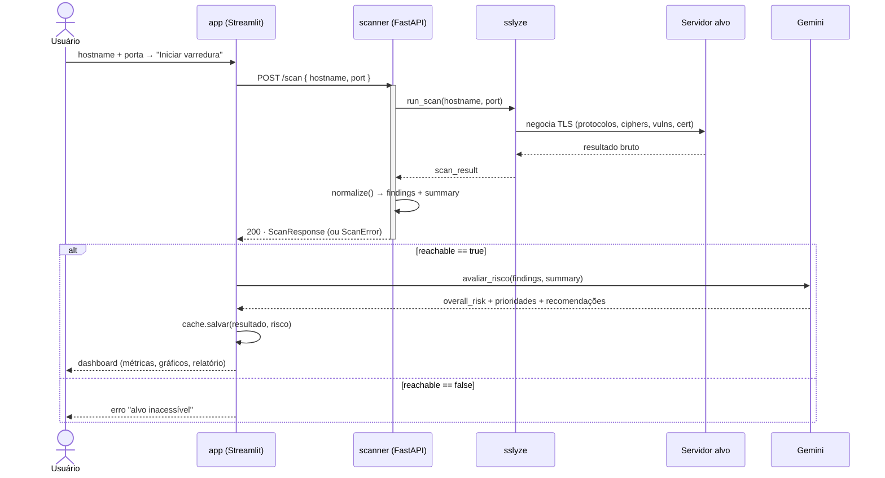
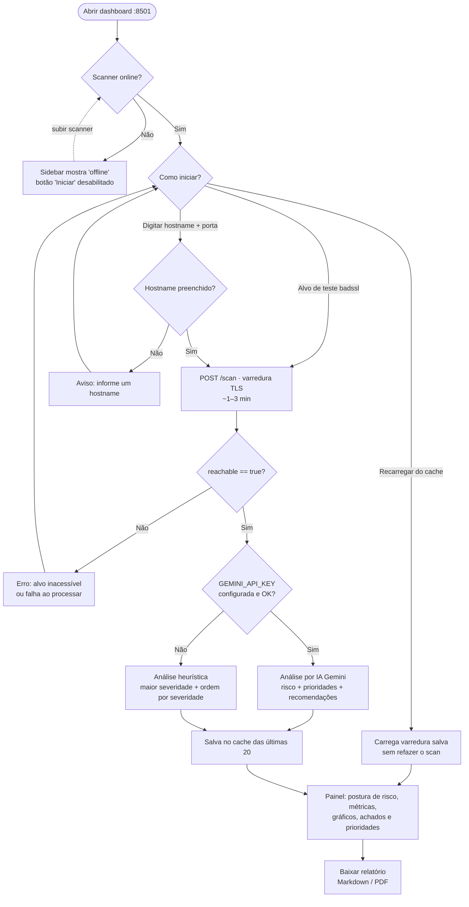

<div align="center">

# 🔒 Scanner SSL/TLS

### Diagnóstico Automatizado de Vulnerabilidades em Servidores Web

Plataforma de auditoria da postura criptográfica (SSL/TLS) de servidores web. Executa uma
varredura **passiva e não destrutiva** de um alvo, detecta problemas de segurança de forma
**determinística e auditável** e apresenta o resultado em um dashboard interativo, enriquecido
por **IA** com classificação de risco, priorização de correções e recomendações acionáveis.


</div>

---

> ### ⚠️ Aviso — uso acadêmico
>
> Esta ferramenta faz parte de um **trabalho acadêmico**. Execute varreduras
> apenas em **ambientes controlados** (ex.: [`badssl.com`](https://badssl.com))
> ou em alvos com **autorização explícita do proprietário**. Varredura sem
> consentimento pode violar leis de crimes cibernéticos.

---

## 📑 Sumário

- [Sobre o projeto](#-sobre-o-projeto)
  - [O que é](#o-que-é)
  - [Finalidade](#finalidade)
  - [Funcionalidades](#funcionalidades)
- [Tecnologias](#-tecnologias)
- [Arquitetura](#-arquitetura)
  - [Visão geral](#visão-geral-dos-componentes)
  - [Diagrama de sequência de uma varredura](#diagrama-de-sequência-de-uma-varredura)
  - [Separação de responsabilidades](#separação-de-responsabilidades)
  - [Estrutura do repositório](#estrutura-do-repositório)
- [Instalação e execução](#-instalação-e-execução)
  - [Pré-requisitos](#pré-requisitos)
  - [Opção A — Com Docker (recomendado)](#opção-a--com-docker-recomendado)
  - [Opção B — Sem Docker (manual)](#opção-b--sem-docker-manual)
- [Configuração](#-configuração)
- [Como usar](#-como-usar)
  - [Fluxograma de uso](#fluxograma-de-uso)
  - [Passo a passo](#passo-a-passo)
- [Referência da API](#-referência-da-api)
- [Modelos de dados](#-modelos-de-dados)
- [Catálogo de detecção](#-catálogo-de-detecção)
- [Análise de risco: IA ou heurística](#-análise-de-risco-ia-ou-heurística)
- [Cache e relatórios](#-cache-e-relatórios)
- [Deploy em produção](#-deploy-em-produção)
- [Segurança e limitações](#-segurança-e-limitações)
- [Documentação por módulo](#-documentação-por-módulo)

---

## 📖 Sobre o projeto

### O que é

O **Scanner SSL/TLS** é uma ferramenta de segurança defensiva que audita a **camada de
transporte (TLS)** de um servidor web e aponta configurações inseguras. Dado um alvo
(`hostname:porta`), a ferramenta:

1. Conecta-se ao servidor e enumera os **protocolos** e **cipher suites** aceitos;
2. Testa **vulnerabilidades** TLS conhecidas (Heartbleed, ROBOT, CCS Injection, CRIME…);
3. Valida o **certificado** (validade, cadeia de confiança, algoritmo de assinatura);
4. Traduz tudo em uma lista de **achados de segurança** classificados por severidade;
5. Usa **IA** para atribuir uma postura de risco geral, priorizar correções e redigir
   recomendações — e gera um **relatório** exportável (Markdown / PDF).

### Finalidade

Este é o **Cenário 1 — Servidor Web** de um trabalho de diagnóstico de vulnerabilidades. O
objetivo é oferecer uma auditoria TLS **confiável, reprodutível e auditável**: cada achado deriva
de uma regra explícita sobre os dados que o `sslyze` coleta — nunca de "adivinhação" de IA. A
inteligência artificial atua apenas **a jusante**, contextualizando e priorizando achados que já
foram detectados de forma determinística.

> A ferramenta é **passiva e não destrutiva**: não executa exploração ativa, apenas lê o que o
> alvo expõe durante a negociação TLS.

### Funcionalidades

- ✅ **Varredura TLS remota** real (via `sslyze`), síncrona e não destrutiva.
- ✅ **Detecção determinística** de protocolos obsoletos, ciphers fracas, certificados inválidos e
  vulnerabilidades clássicas.
- ✅ **Motor de regras declarativo** (`rules.yaml`) — a maioria das detecções se adiciona sem
  escrever código.
- ✅ **Classificação de risco por IA** (Gemini) com priorização e recomendações em PT-BR.
- ✅ **Degradação elegante**: sem chave de IA, cai numa heurística determinística e continua 100%
  funcional.
- ✅ **Dashboard interativo** com métricas por severidade, gráficos e cards de achados.
- ✅ **Relatórios exportáveis** em Markdown e PDF.
- ✅ **Cache** das últimas 20 varreduras, recarregáveis sem refazer o scan.
- ✅ **Pronto para container**: `docker compose` com health checks e labels Traefik.

---

## 🛠 Tecnologias

| Camada            | Tecnologia            | Versão     | Papel                                                       |
| ----------------- | --------------------- | ---------- | ----------------------------------------------------------- |
| **Linguagem**     | Python                | 3.13+      | Base de ambos os serviços                                   |
| **API**           | FastAPI               | 0.138      | Microsserviço HTTP do scanner                               |
| **Servidor ASGI** | Uvicorn               | 0.49       | Runtime do FastAPI                                          |
| **Varredura TLS** | sslyze                | 6.3.1      | Negociação TLS, enumeração de ciphers, testes de vuln, cert |
| **Validação**     | Pydantic              | 2.13       | Contratos de entrada/saída (schemas)                        |
| **Regras**        | PyYAML                | 6.0        | Motor declarativo de detecção (`rules.yaml`)                |
| **Dashboard**     | Streamlit             | 1.57       | Interface web e orquestração do fluxo                       |
| **IA**            | google-genai (Gemini) | 2.10       | Classificação de risco a jusante                            |
| **Gráficos**      | Plotly / Matplotlib   | 6.8 / 3.11 | Visualização por severidade e categoria                     |
| **Relatório PDF** | reportlab             | 5.0        | Geração do relatório exportável                             |
| **HTTP client**   | requests              | 2.34       | Comunicação app → scanner                                   |
| **Container**     | Docker + Compose      | —          | Empacotamento e orquestração                                |
| **Proxy reverso** | Traefik (Dokploy)     | —          | TLS/roteamento em produção                                  |

> Cada serviço tem o **seu próprio** `requirements.txt` com versões **fixadas (pinned)**. Ver
> [`scanner/requirements.txt`](scanner/requirements.txt) e [`app/requirements.txt`](app/requirements.txt).

---

## 🏗 Arquitetura

O sistema segue uma arquitetura de **dois serviços independentes** comunicando-se por HTTP, com
uma dependência externa opcional (Gemini). A separação é deliberada: **detecção** e
**interpretação/IA** nunca se misturam.

### Visão geral dos componentes



### Diagrama de sequência de uma varredura



> ⏱ **A varredura é remota, real e síncrona (~1–3 min)**, podendo ultrapassar em alvos com muitos
> protocolos legados ativos. Por isso o timeout do cliente é folgado (`SCAN_TIMEOUT_S=300`).

### Separação de responsabilidades

| Camada             | Onde                                        | O que faz                                                                                                                    |
| ------------------ | ------------------------------------------- | ---------------------------------------------------------------------------------------------------------------------------- |
| **Varredura**      | `scanner/core/scanner.py` (sslyze)          | Conecta no alvo, negocia TLS, enumera protocolos/ciphers, roda testes de vuln, valida o cert. Produz um **resultado bruto**. |
| **Interpretação**  | `scanner/core/normalizer.py` + `rules.yaml` | Traduz o resultado bruto em **achados** (`Finding`) legíveis com severidade. **Determinístico.**                             |
| **Contrato**       | `scanner/models/schemas.py` (Pydantic)      | Define a forma de entrada/saída da API. **Fonte da verdade.**                                                                |
| **Orquestração**   | `app/Scanner_Web_Server.py`                 | Coleta o alvo, chama o scanner, dispara a IA, monta o painel.                                                                |
| **IA (a jusante)** | `app/services/gemini_client.py`             | Classifica risco, prioriza e recomenda. **Nunca detecta nada novo.**                                                         |
| **Apresentação**   | `app/components/*`                          | CSS, métricas, gráficos, cards e relatório (Markdown/PDF).                                                                   |

**Regra de ouro do contrato:** "alvo inacessível" volta como **HTTP 200** com `reachable: false`.
Clientes ramificam pelo campo `reachable`, **não** pelo status HTTP. Ver
[Referência da API](#-referência-da-api).

### Estrutura do repositório

```
ps3/
├── docker-compose.yml          # sobe os dois serviços (com labels Traefik)
├── .env.example                # modelo de variáveis de ambiente (copie p/ .env)
├── README.md                   # este arquivo — visão geral do projeto
│
├── scanner/                    # ── microsserviço de detecção (FastAPI + sslyze)
│   ├── main.py                 # app FastAPI (suporta API_PREFIX p/ proxy reverso)
│   ├── api/
│   │   └── routes.py           # endpoints /health e /scan
│   ├── core/
│   │   ├── scanner.py          # executa o sslyze contra o alvo
│   │   ├── normalizer.py       # traduz resultado bruto → achados (Finding)
│   │   └── rules.yaml          # regras declarativas de protocolo/cipher/vuln
│   ├── models/
│   │   └── schemas.py          # contratos Pydantic (ScanInput/Response/Error/Finding)
│   ├── Dockerfile
│   ├── requirements.txt
│   └── README.md               # ▶ documentação completa da API
│
└── app/                        # ── dashboard (Streamlit)
    ├── Scanner_Web_Server.py   # página principal (orquestra o fluxo)
    ├── config.py               # configuração central (URLs, chaves, paleta)
    ├── services/
    │   ├── scanner_client.py   # cliente HTTP do microsserviço Scanner
    │   ├── gemini_client.py    # camada de IA (classificação de risco)
    │   └── cache.py            # cache em disco das últimas 20 varreduras
    ├── components/
    │   ├── styles.py           # CSS / identidade visual
    │   ├── findings_view.py    # métricas, gráficos e cards de achados
    │   └── report.py           # geração de relatório Markdown e PDF
    ├── .streamlit/
    │   └── secrets.toml.example # modelo de configuração
    ├── Dockerfile
    ├── requirements.txt
    └── README.md               # ▶ documentação completa do dashboard
```

---

## 🚀 Instalação e execução

### Pré-requisitos

- **Docker + Docker Compose** (para a Opção A), **ou**
- **Python 3.13+** e `pip` (para a Opção B).
- (Opcional) Uma **chave de API do Gemini** para a classificação por IA. Sem ela, o app usa uma
  heurística determinística e continua funcional.

### Opção A — Com Docker (recomendado)

Sobe o scanner e o app juntos, já em rede. O app aguarda o scanner ficar _healthy_ antes de subir
(`depends_on: condition: service_healthy`), e ambos os Dockerfiles definem `HEALTHCHECK`.

```bash
# 1. Clone o repositório
git clone <url-do-repo> ps3 && cd ps3

# 2. Crie o .env a partir do modelo e preencha (ao menos GEMINI_API_KEY, opcional)
cp .env.example .env
#   O Docker Compose lê o .env da raiz automaticamente.

# 3. Suba os serviços
docker compose up --build
```

> ⚠️ **Rede Traefik.** O `docker-compose.yml` foi preparado para produção: usa uma rede externa
> (`dokploy-network` por padrão) e labels do Traefik. Para rodar **localmente sem Traefik**, você
> pode precisar criar a rede e/ou publicar portas. A forma mais simples de teste local é a
> [Opção B](#opção-b--sem-docker-manual). Para deploy com proxy, ver [Deploy em produção](#-deploy-em-produção).

Variáveis reconhecidas pelo `docker-compose.yml`:

| Variável          | Padrão             | Descrição                           |
| ----------------- | ------------------ | ----------------------------------- |
| `GEMINI_API_KEY`  | _(vazio)_          | Chave do Gemini; vazio → heurística |
| `GEMINI_MODEL`    | `gemini-2.5-flash` | Modelo Gemini                       |
| `SCAN_TIMEOUT_S`  | `300`              | Timeout da varredura (segundos)     |
| `TRAEFIK_NETWORK` | `dokploy-network`  | Nome da rede externa do proxy       |

### Opção B — Sem Docker (manual)

Requer **Python 3.13+**. São **dois processos** em **dois venvs separados** — use dois terminais.

<details open>
<summary><b>Terminal 1 — Scanner (microsserviço, porta 8000)</b></summary>

```bash
cd scanner
python -m venv venv
source venv/bin/activate            # Windows: .\venv\Scripts\Activate.ps1
pip install -r requirements.txt
uvicorn main:app --host 0.0.0.0 --port 8000
```

- Swagger UI (docs interativas): <http://localhost:8000/docs>
- Esquema OpenAPI: <http://localhost:8000/openapi.json>
- Health check: <http://localhost:8000/health>

</details>

<details open>
<summary><b>Terminal 2 — App (dashboard, porta 8501)</b></summary>

```bash
cd app
python -m venv venv                 # venv PRÓPRIO, separado do scanner
source venv/bin/activate            # Windows: .\venv\Scripts\Activate.ps1
pip install -r requirements.txt
streamlit run Scanner_Web_Server.py
```

Acesse <http://localhost:8501>.

</details>

> 🔑 **Não compartilhe venvs.** O `scanner/` e o `app/` têm dependências diferentes e
> propositalmente isoladas.

---

## ⚙️ Configuração

Toda a configuração é feita por **variáveis de ambiente**. O projeto traz um
[`.env.example`](.env.example) na raiz com todas as chaves documentadas — o ponto de partida
recomendado:

```bash
cp .env.example .env
# edite o .env e preencha ao menos GEMINI_API_KEY (opcional, mas recomendado)
```

O mesmo `.env` serve para os dois modos de execução:

- **Com Docker** — o Docker Compose lê o `.env` da raiz automaticamente e injeta os valores nos serviços.
- **Sem Docker (local)** — o `app/config.py` carrega o `.env` da raiz automaticamente via
  `python-dotenv` (incluído no `app/requirements.txt`). Basta ter o `.env` preenchido; não é preciso
  `export` nem `source`.

A ordem de precedência ao resolver cada valor é: **variáveis já definidas no ambiente** (ex.:
injetadas pelo Docker) › **`.env`** › **`app/.streamlit/secrets.toml`** (`st.secrets`) › padrão.
Ou seja, uma variável exportada no shell sobrepõe o `.env`, que por sua vez é uma alternativa ao
`secrets.toml`.

### 🤖 Chave da API do Gemini

A classificação de risco por IA usa o **Google Gemini**. Para habilitá-la:

1. Gere uma chave em **<https://aistudio.google.com/apikey>**.
2. Defina `GEMINI_API_KEY` no `.env` (ou exporte no shell / coloque no `secrets.toml`).
3. (Opcional) Ajuste `GEMINI_MODEL` — o padrão é `gemini-2.5-flash`.

> Sem `GEMINI_API_KEY`, **o app continua 100% funcional**: a análise cai para uma heurística
> determinística (maior severidade presente) e exibe a tag "Análise heurística" no lugar de
> "Análise por IA".

### Variáveis do dashboard (`app/`)

| Variável           | Padrão                  | Descrição                                                  |
| ------------------ | ----------------------- | ---------------------------------------------------------- |
| `GEMINI_API_KEY`   | _(vazio)_               | Chave do Google Gemini; vazio → heurística determinística  |
| `GEMINI_MODEL`     | `gemini-2.5-flash`      | Modelo Gemini usado na análise de risco                    |
| `SCANNER_URL`      | `http://localhost:8000` | URL do microsserviço Scanner (no compose: `http://scanner:8000`) |
| `SCAN_TIMEOUT_S`   | `300`                   | Timeout da varredura (segundos) — a varredura é lenta      |
| `HEALTH_TIMEOUT_S` | `5`                     | Timeout do health check do scanner exibido na sidebar      |

### Variáveis do scanner (`scanner/`)

| Variável            | Padrão      | Descrição                                                        |
| ------------------- | ----------- | ---------------------------------------------------------------- |
| `API_PREFIX`        | _(vazio)_   | Prefixo de rota (ex.: `/api`) para servir atrás de proxy reverso |
| `FASTAPI_ROOT_PATH` | _(vazio)_   | Root path do FastAPI quando montado sob um subcaminho            |

### Variáveis de infraestrutura (Docker Compose)

| Variável          | Padrão            | Descrição                                        |
| ----------------- | ----------------- | ------------------------------------------------ |
| `TRAEFIK_NETWORK` | `dokploy-network` | Nome da rede externa do proxy reverso (Traefik)  |

> 🔒 **Nunca comite** o `.env` real nem o `app/.streamlit/secrets.toml` — ambos estão no
> `.gitignore`. Versione apenas o [`.env.example`](.env.example).

---

## 🖱 Como usar

### Fluxograma de uso

O diagrama abaixo resume a jornada do usuário no dashboard — do carregamento da página à
exportação do relatório —, incluindo os principais pontos de decisão (scanner online, recarga de
cache, alvo acessível e IA vs. heurística):



### Passo a passo

1. Abra o dashboard (<http://localhost:8501>). A sidebar mostra o **status do scanner** (online/offline).
2. Informe um **hostname** (sem `https://`) e a **porta** (padrão `443`) — ou clique em um
   [alvo de teste](#alvos-de-teste).
3. Clique em **Iniciar varredura**. Aguarde (~1–3 min).
4. O painel exibe:
   - **Postura de risco geral** (com tag indicando se foi IA ou heurística);
   - **Métricas por severidade** (`critical` › `high` › `medium` › `low` › `info`);
   - **Gráficos** por severidade e por categoria;
   - **Achados detectados** e aba de **Prioridades de correção**;
   - Botões para **baixar o relatório** em Markdown e PDF.
5. Varreduras ficam em **cache** e reaparecem na sidebar para recarga instantânea.

#### Alvos de teste

Ambiente controlado do [badssl.com](https://badssl.com) — use apenas para validação:

| Alvo                     | Porta | Achado esperado               |
| ------------------------ | ----- | ----------------------------- |
| `expired.badssl.com`     | 443   | `cert_expired`                |
| `self-signed.badssl.com` | 443   | `cert_self_signed`            |
| `rc4.badssl.com`         | 443   | `cipher_rc4_*`                |
| `tls-v1-0.badssl.com`    | 1010  | `proto_tls_1_0_cipher_suites` |

---

## 🔌 Referência da API

Base URL padrão: `http://localhost:8000`. Documentação interativa completa em `/docs`.

### `GET /health`

Verifica se o serviço está no ar (não executa varredura). Use como _readiness probe_.

```json
{ "status": "ok" }
```

### `POST /scan`

Executa a varredura TLS e retorna os achados. Corpo: [`ScanInput`](#-modelos-de-dados).

```bash
curl -s -X POST http://localhost:8000/scan \
  -H "Content-Type: application/json" \
  -d '{"hostname": "expired.badssl.com", "port": 443}'
```

**Exemplo de resposta `200` (alvo varrido):**

```json
{
  "target": "expired.badssl.com:443",
  "scanned_at": "2026-06-21T18:00:00Z",
  "reachable": true,
  "summary": { "critical": 1, "high": 0, "medium": 0, "low": 1, "info": 0 },
  "total_findings": 2,
  "findings": [
    {
      "id": "cert_expired",
      "category": "certificate",
      "title": "Certificado expirado",
      "detail": "O certificado venceu em 2015-04-12.",
      "severity_hint": "critical"
    },
    {
      "id": "cfg_no_hsts",
      "category": "configuration",
      "title": "Cabeçalho HSTS ausente",
      "detail": "Sem Strict-Transport-Security, o cliente pode ser rebaixado para HTTP.",
      "severity_hint": "low"
    }
  ]
}
```

**Tratamento de respostas:**

| Situação                   | Status | Corpo                                   | Como tratar                               |
| -------------------------- | ------ | --------------------------------------- | ----------------------------------------- |
| Varredura concluída        | `200`  | `ScanResponse` (`reachable: true`)      | Processar `findings`                      |
| Alvo inacessível (sem TLS) | `200`  | `ScanError` (`reachable: false`)        | Exibir `error`; **não há** achados        |
| Falha ao normalizar        | `200`  | `ScanError` (`reachable: true`)         | Alvo alcançado, resultado não processável |
| Entrada inválida           | `422`  | `{ "detail": [...] }`                   | Corrigir o corpo da requisição            |
| Falha interna inesperada   | `500`  | `{ "detail": "Internal Server Error" }` | Reportar/registrar                        |

> **Importante:** "alvo inacessível" e "falha ao normalizar" são respostas `200` de negócio.
> **Sempre ramifique pelo campo `reachable`** antes de assumir que há `summary`/`findings`.

📚 Endpoints, exemplos de integração (cURL/Python) e tratamento de erros completos em
**[`scanner/README.md`](scanner/README.md)**.

---

## 🧬 Modelos de dados

Definidos em [`scanner/models/schemas.py`](scanner/models/schemas.py) (Pydantic).

**`ScanInput`** — entrada:

| Campo      | Tipo   | Padrão | Descrição                        |
| ---------- | ------ | ------ | -------------------------------- |
| `hostname` | string | —      | Host a auditar (sem esquema/URL) |
| `port`     | int    | `443`  | Porta TLS do alvo                |

**`Finding`** — um achado de segurança:

| Campo           | Tipo                                                       | Descrição                         |
| --------------- | ---------------------------------------------------------- | --------------------------------- |
| `id`            | string                                                     | Identificador estável (contrato)  |
| `category`      | `protocol` \| `cipher` \| `certificate` \| `configuration` | Família do achado                 |
| `title`         | string                                                     | Título curto (PT-BR)              |
| `detail`        | string                                                     | Descrição do problema (PT-BR)     |
| `severity_hint` | `critical` \| `high` \| `medium` \| `low` \| `info`        | Severidade sugerida pela detecção |

**`ScanResponse`** — varredura bem-sucedida: `target`, `scanned_at`, `reachable`, `summary`
(contagem por severidade), `total_findings`, `findings[]`.

**`ScanError`** — falha: `target`, `reachable`, `error`, `findings` (sempre `[]`). Distingue dois
casos por `reachable`: `false` = sem conectividade TLS; `true` = alvo alcançado mas a normalização
falhou.

---

## 🔎 Catálogo de detecção

Resumo por família de achado (catálogo completo com todos os IDs em
[`scanner/README.md`](scanner/README.md#catálogo-de-achados)):

| Categoria       | Exemplos                                                               | Severidade típica   |
| --------------- | ---------------------------------------------------------------------- | ------------------- |
| `protocol`      | SSLv2/SSLv3 habilitados, TLS 1.0/1.1, ausência de TLS 1.2/1.3          | `critical`–`high`   |
| `cipher`        | NULL/anônima, RC4, EXPORT, 3DES (Sweet32), MD5, chave < 128 bits       | `critical`–`medium` |
| `certificate`   | expirado, ainda-não-válido, autoassinado, cadeia não confiável, SHA-1  | `critical`–`medium` |
| `configuration` | Heartbleed, CCS Injection, ROBOT, CRIME (compressão TLS), HSTS ausente | `critical`–`low`    |

**Severidades**, em ordem decrescente: `critical` › `high` › `medium` › `low` › `info`.

### Alinhamento com guias da indústria

As detecções e severidades do `normalizer` **não são arbitrárias**: cada uma reflete um consenso
documentado de guias e normas amplamente reconhecidos. O conjunto foi mantido deliberadamente
**conservador** — só entram achados de alto consenso e baixo falso-positivo — para que a saída seja
confiável e defensável. As principais referências são:

- **[Qualys SSL Labs — SSL Server Rating Guide](https://github.com/ssllabs/research/wiki/SSL-Server-Rating-Guide)** — critérios de nota (protocolos, troca de chaves, força de cipher) e capping por fraquezas conhecidas.
- **[Mozilla — Server Side TLS / TLS configuration recommendations](https://wiki.mozilla.org/Security/Server_Side_TLS)** — perfis *Modern / Intermediate / Old* que definem o que é aceitável hoje.
- **IETF RFCs** — [RFC 8996](https://datatracker.ietf.org/doc/html/rfc8996) (depreciação de TLS 1.0/1.1), [RFC 7568](https://datatracker.ietf.org/doc/html/rfc7568) (proibição de SSLv3), [RFC 6176](https://datatracker.ietf.org/doc/html/rfc6176) (proibição de SSLv2), [RFC 6797](https://datatracker.ietf.org/doc/html/rfc6797) (HSTS).

Como cada família se justifica:

| Detecção                        | Severidade   | Justificativa e referência                                                                                       |
| ------------------------------- | ------------ | --------------------------------------------------------------------------------------------------------------- |
| **SSLv2 / SSLv3 habilitados**   | `critical`   | Criptografia quebrada (DROWN, POODLE). Proibidos por RFC 6176/7568; SSL Labs reprova (nota F).                   |
| **TLS 1.0 / 1.1 habilitados**   | `high`       | Depreciados pela IETF em 2021 (RFC 8996); fora dos perfis Mozilla atuais.                                        |
| **Ausência de TLS 1.2/1.3**     | `high`       | TLS 1.2 é o mínimo dos perfis Mozilla Intermediate/Modern; sem ele o servidor não negocia criptografia atual.   |
| **Cipher NULL / anônima**       | `critical`   | Sem confidencialidade/autenticação — excluída por SSL Labs e por todos os perfis Mozilla.                       |
| **RC4**                         | `high`       | Quebrada (RFC 7465 proíbe RC4 em TLS); banida pelos guias.                                                       |
| **EXPORT**                      | `high`       | Chaves curtas propositais — base dos ataques FREAK/Logjam.                                                       |
| **3DES**                        | `medium`     | Sweet32 (CVE-2016-2183); removida dos perfis modernos.                                                           |
| **MD5**                         | `medium`     | Hash quebrado; inaceitável para MAC/assinatura.                                                                  |
| **Chave simétrica < 128 bits**  | `high`       | Abaixo do mínimo recomendado por SSL Labs / Mozilla.                                                             |
| **Heartbleed**                  | `critical`   | CVE-2014-0160 — leitura de memória do servidor.                                                                  |
| **CCS Injection**               | `critical`   | CVE-2014-0224 — interceptação da comunicação.                                                                    |
| **ROBOT**                       | `high`       | Oráculo Bleichenbacher contra RSA (2017).                                                                        |
| **CRIME (compressão TLS)**      | `medium`     | CVE-2012-4929 — vazamento via compressão; compressão TLS desaconselhada.                                         |
| **HSTS ausente**                | `low`        | Higiene de configuração (RFC 6797); ausência permite downgrade para HTTP.                                        |
| **Certificado expirado / não-válido / autoassinado / cadeia não confiável / SHA-1** | `critical`–`medium` | Estados que invalidam a confiança da cadeia; SHA-1 em assinatura é obsoleto (deprecado por navegadores). |

> ⚖️ A `severity_hint` é uma **dica** alinhada a esse consenso — a classificação de risco final
> pode recontextualizar ([Análise por IA](#-análise-de-risco-ia-ou-heurística)). O detalhamento
> completo dessa seleção está em
> [`scanner/README.md`](scanner/README.md#como-as-regras-atuais-foram-selecionadas).

### Como as regras funcionam

A detecção separa **duas** definições:

- **Declarativa (YAML)** — protocolos, ciphers e vulnerabilidades vivem em
  [`scanner/core/rules.yaml`](scanner/core/rules.yaml). Adicionar uma detecção geralmente significa
  só editar esse arquivo — **sem tocar em código**.
- **Imperativa (código)** — regras de certificado (aritmética de datas, cadeia de confiança) ficam
  em `_check_certificate` no `normalizer.py`, onde a lógica condicional as torna mais auditáveis em
  Python do que em YAML.

```yaml
# Exemplo (rules.yaml): sinalizar uma cipher fraca por palavra-chave no nome
cipher_classes:
  - id: rc4
    keywords: [RC4]
    severity: high
    title: "Cipher fraca (RC4): {nome}"
    detail: "RC4 é vulnerável e não deve ser utilizada."
```

📚 O guia definitivo — filosofia, critérios para uma regra existir, anatomia do `rules.yaml`,
armadilhas do YAML e passo a passo para adicionar/testar uma regra — está em
**[`scanner/README.md`](scanner/README.md#como-as-regras-são-definidas)**.

---

## 🧠 Análise de risco: IA ou heurística

A **detecção** dos achados é sempre determinística (o scanner nunca usa IA). O que varia é a
camada de **análise de risco a jusante** — a que classifica a postura geral, prioriza e recomenda.
Ela opera em **dois modos**, e o app escolhe automaticamente qual usar; o painel sempre indica com
uma tag qual esteve em vigor.

| Aspecto                | 🤖 **Análise por IA** (Gemini)                          | 📐 **Análise heurística** (fallback)                        |
| ---------------------- | ------------------------------------------------------- | ----------------------------------------------------------- |
| **Quando é usada**     | `GEMINI_API_KEY` configurada **e** a chamada bem-sucedida | Chave ausente **ou** falha/erro na chamada à IA           |
| **Postura de risco**   | Inferida pelo modelo, com justificativa contextual      | Maior severidade presente entre os achados                  |
| **Priorização**        | Ordem argumentada pelo modelo (o que corrigir primeiro) | Ordem por severidade (`critical` → `info`)                  |
| **Recomendações**      | Redigidas pela IA, acionáveis e contextualizadas em PT-BR | Deriva do campo `detail` de cada achado                   |
| **Tag no painel**      | "Análise por IA"                                        | "Análise heurística"                                        |
| **Requer internet/chave** | Sim                                                  | Não — 100% local e determinístico                           |

Ambos os modos produzem a **mesma estrutura** de saída (postura geral + prioridades), então o
dashboard e o relatório funcionam de forma idêntica nos dois casos.

### Como funciona a análise por IA

O enriquecimento acontece no app
([`app/services/gemini_client.py`](app/services/gemini_client.py)) e recebe os achados **já
detectados** para: (1) atribuir a **postura de risco geral** com justificativa, (2) **priorizar** os
achados e (3) redigir **recomendações acionáveis** em PT-BR. O prompt instrui o modelo a **não
inventar vulnerabilidades** — apenas classificar e priorizar o que foi fornecido — e a responder
**exclusivamente em JSON** (`temperature=0.2`, `response_mime_type: application/json`).

### Como funciona o fallback heurístico

Se a IA não estiver disponível, o app cai em `_fallback_heuristico` de forma transparente e
**permanece 100% funcional**: a postura geral vira a maior severidade presente e as prioridades
seguem a ordem de severidade. É determinístico, não depende de rede nem de chave, e é o que roda
por padrão quando você não configura o `GEMINI_API_KEY`.

> Ver [Configuração › Chave da API do Gemini](#-chave-da-api-do-gemini) para habilitar o modo IA.

---

## 💾 Cache e relatórios

**Cache** ([`app/services/cache.py`](app/services/cache.py)) — as últimas **20 varreduras**
bem-sucedidas são gravadas em `app/.cache/` (JSON + índice). Reaparecem na sidebar e podem ser
recarregadas instantaneamente, sem refazer o scan (que leva minutos). Entradas mais antigas são
descartadas automaticamente; há botão para **limpar o cache**.

**Relatórios** ([`app/components/report.py`](app/components/report.py)) — cada varredura pode ser
exportada como:

- **Markdown** — texto estruturado com vulnerabilidades, riscos e recomendações;
- **PDF** — via `reportlab` (com fallback gracioso caso a geração falhe).

---

## 🌐 Deploy em produção

O `docker-compose.yml` já vem preparado para **Traefik** (usado com **Dokploy**):

- Ambos os serviços entram na rede externa `${TRAEFIK_NETWORK:-dokploy-network}`.
- O **app** responde no host `scanner.lsx.li` (porta interna `8501`, prioridade de rota `1`).
- O **scanner** responde em `scanner.lsx.li/api` (porta interna `8000`, prioridade `100` — mais
  específica), com `API_PREFIX=/api` para casar o `PathPrefix` do Traefik.
- TLS habilitado via `entrypoints=websecure`, `tls=true`.
- `HEALTHCHECK` em ambos os containers; o app só sobe quando o scanner está _healthy_.

Para adaptar ao seu domínio, ajuste as labels `Host(...)`, o `API_PREFIX` e o `SCANNER_URL`
conforme a sua topologia de rede.

---

## 🔐 Segurança e limitações

- **Somente alvos autorizados.** Rode varreduras apenas contra hosts que você tem permissão para
  auditar, ou contra o `badssl.com`. Embora passiva, a varredura abre conexões TLS reais no alvo.
- **Não destrutivo por design.** Não há exploração ativa — apenas leitura do que o alvo expõe.
- **Falso "certificado não confiável" atrás de proxy.** Proxies que interceptam TLS (ou a ausência
  do certificado intermediário) podem fazer o `sslyze` reportar `cert_untrusted` incorretamente —
  ou até impedir a conectividade (`reachable: false`).
- **Versões fixadas.** **Não atualize o `sslyze` (`6.3.1`) sem testar** — a API de resultado muda
  entre versões e pode quebrar o `normalizer` silenciosamente.
- **Varredura lenta e síncrona.** Configure timeouts de cliente ≥ 300 s.
- **Segredos.** Nunca comite chaves; use variáveis de ambiente ou `secrets.toml` (ignorado no git).

---

## 📚 Documentação por módulo

Cada serviço tem uma documentação aprofundada e independente:

| Módulo        | Documento                                       | Conteúdo                                                                                                                                                                  |
| ------------- | ----------------------------------------------- | ------------------------------------------------------------------------------------------------------------------------------------------------------------------------- |
| **Scanner**   | 📄 **[`scanner/README.md`](scanner/README.md)** | API completa: endpoints, modelos de dados, catálogo de achados, tratamento de erros, exemplos de integração (cURL/Python) e o **guia de como definir e estender regras**. |
| **Dashboard** | 📄 **[`app/README.md`](app/README.md)**         | Estrutura interna, configuração, execução e comportamento detalhado da camada de IA e do cache.                                                                           |

---

<div align="center">
<sub>Cenário 1 — Servidor Web · Diagnóstico de vulnerabilidades SSL/TLS</sub>
</div>
